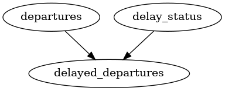

# Redshift Lineage

CLI tool to extract table-level lineage information from Redshift SQL code.
Fully understands the Redshift dialect and can parse complex SQL statements.

Given this input SQL code:
```yaml
CREATE TABLE departures AS (SELECT train_id, departure_time FROM schedule);
SELECT train_id, departure_time INTO delayed_departures FROM departures JOIN delay_status USING(train_id)  
```

Produces this output:
```yaml
statements:
  - lineage:
      - target:
          name: "departures"
        sources:
          - name: "schedule"
    sources:
      - name: "schedule"
  - lineage:
      - target:
          name: "delayed_departures"
        sources:
          - name: "departures"
          - name: "delay_status"
    sources:
      - name: "departures"
      - name: "delay_status"
```

### Main functionalities:

- Parse Redshift SQL code from files or stdin
- Split SQL scripts into individual statements
- Extract table-level lineage information from SQL statements
- Report lineage in YAML or JSON format
- Locate the statements in the input SQL code and report their positions

## Installation

To run the CLI tool, you will need Java Runtime Environment (JRE) version 17 or higher installed on your 
system and accessible via the java command in your terminal.

- Download the latest ZIP archive from the [Latest Release](https://github.com/dtrounine/redshift-lineage/releases/latest)
page, and extract it to a directory of your choice.

- Add the extracted `bin` directory to your system’s PATH environment variable to make the CLI tool accessible globally.

### Example for Linux:

```bash
# Download and unzip the latest release
REDSHIFT_LINEAGE_VERSION="0.3.2"
curl -L https://github.com/dtrounine/redshift-lineage/releases/download/${REDSHIFT_LINEAGE_VERSION}/redshift-lineage-${REDSHIFT_LINEAGE_VERSION}.zip
unzip redshift-lineage-${REDSHIFT_LINEAGE_VERSION}.zip
mv redshift-lineage-${REDSHIFT_LINEAGE_VERSION} redshift-lineage

# Add to PATH (temporary for current session)
export PATH="$PWD/redshift-lineage/bin:$PATH"

# Optionally add to PATH permanently by appending to ~/.bashrc or ~/.zshrc
echo "export PATH=\"$PWD/redshift-lineage/bin:\$PATH\"" >> ~/.bashrc
```

## Usage

To run the tool, use the `redshift-lineage` command specifying the input SQL file (or using stdin if no file is provided), 
and optionally the output file (or the stdout will be used if no output file is specified). Other options include the 
output format and `--split-statements` (see below)

```bash
$ redshift-lineage --help
Usage: redshift-lineage [<options>]

  Redshift SQL lineage extractor

Options:
  --out-file=<value>                    Pathname of the output file. Stdout by default.
  --in-file=<value>                     Pathname of the input file. Stdin by default.
  --out-format=(json|openlineage|yaml)  Output format. Default is json.
  --split-statements                    Split the input into separate statements for processing. Output the lineage for each statement separately. This option is disabled by
                                        default.
  -h, --help                            Show this message and exit

```

## Output formats

The tool supports the following output formats:
- `json` - JSON format, default
- `yaml` - YAML format
- `openlineage` - experimental format compatible with OpenLineage specification: new-line delimited JSON objects, each representing an OpenLineage run event.

All formats include the lineage information, statement positions, and source tables.

### Lineage information

The output includes one or several pieces of lineage information: `lineage` field in `json` or `yaml` formats, one event
in `openlineage` format. It includes the links of **sinks** and the list of **sources** representing the data flow
from sources to sinks, or the sources are otherwise used to produce the sinks.

```yaml
  - lineage:
      - target:
          name: "delayed_departures"
        sources:
          - name: "departures"
          - name: "delay_status"
```



### Statement positions

Each lineage information block is accompanied by the `context` fields which provides information about the corresponding
SQL statement -- the filename (if it was provided as input argument) and the position of the statement in the input 
SQL script. Position of a statement is represented by the `start` and `stop` fields, 
which are pairs of line (1-based) and column (0-based) numbers.

```yaml
  context:
    sourceName: "example.sql"
    positionInSource:
      start:
        line: 1
        positionInLine: 0
      stop:
        line: 2
        positionInLine: 105
```

## Split statements

If the `--split-statements` option is enabled, the tool will split the input SQL script into individual statements and
report the lineage for each statement separately. This is useful if you want to obtain the fine-grained lineage 
information for complex SQL scripts with multiple statements.

Otherwise, if the option is disabled, the tool will process the entire input SQL script as a single statement 
and report the lineage for the entire script. So the output will contain one lineage block with one list of sinks
and one list of sources. This can be useful if you are interested only in the overall lineage of the script, or in case
the script contains intermediate temporary tables that are not needed in the final output.

# Project Status

This project is currently in early development, and while it is functional, you may encounter bugs or 
unexpected behavior. Your feedback is valuable and will help improve the tool.

If you run into an issue, please open a [GitHub issue](https://github.com/dtrounine/redshift-lineage/issues) 
and include:

- A minimal example SQL script that reproduces the problem
- A clear description of the error or unexpected output
- Any relevant logs or command-line output

We appreciate your help in making this project better!
